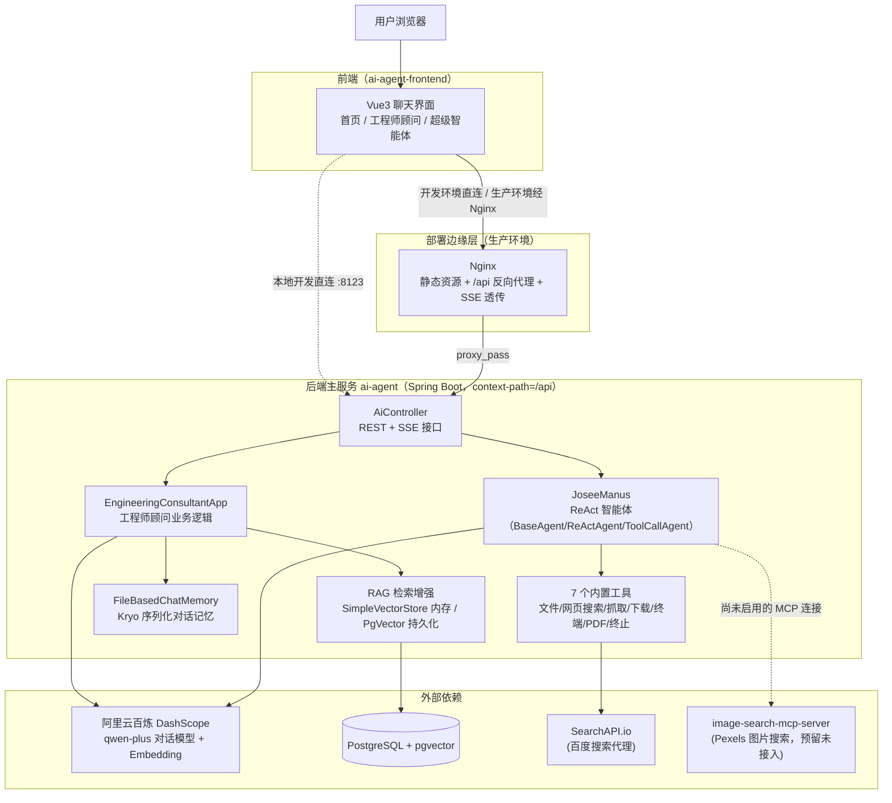
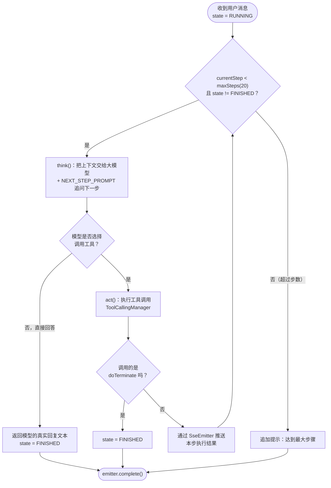

# AI Agent 项目

一个围绕阿里云百炼（DashScope）大模型构建的 AI 应用集合：一个具备多轮记忆 + RAG 知识库问答能力的"工程师顾问"，一个具备自主规划 + 工具调用能力的"超级智能体"（仿 Manus/OpenManus 的 ReAct 智能体框架），一个 Vue3 聊天前端，以及一个独立的图片搜索 MCP 工具服务。

仓库地址：`https://github.com/nanal233/ai-agent`

## 项目组成

这是一个包含三个可独立部署单元的仓库：

| 目录 | 角色 | 技术栈 | 接入状态 |
| --- | --- | --- | --- |
| 仓库根目录（`src/`、`pom.xml`） | 后端主服务 `ai-agent` | Spring Boot 3.5 + Spring AI + Spring AI Alibaba | 核心服务，独立部署 |
| [`ai-agent-frontend/`](ai-agent-frontend) | 前端聊天界面 | Vue 3 + Vite | 通过 SSE 调用后端，独立部署 |
| [`image-search-mcp-server/`](image-search-mcp-server) | 图片搜索 MCP 工具服务 | Spring Boot + Spring AI MCP Server | 已实现，**当前未接入主服务**（见下文说明） |

## 整体架构



### Manus 智能体的 ReAct 执行循环



## 功能模块

### 1. AI 工程师顾问（`EngineeringConsultantApp`）

面向后端架构设计、技术选型与系统重构的对话顾问，围绕"项目初期选型 / 现有系统重构 / 性能与扩展性瓶颈"三类场景设计了引导性系统提示词。同一套业务逻辑通过多个方法演示了 Spring AI 的不同能力：

- `doChat` / `doChatByStream`：基础多轮对话（同步 / 流式），基于 `chatId` 做会话隔离，前端实际使用的是流式版本
- `doChatWithReport`：结构化输出（返回固定 JSON 结构的"咨询报告"）
- `doChatWithRag`：接入 RAG 知识库问答（先做查询重写，再检索向量库、拼接上下文回答）
- `doChatWithTools` / `doChatWithMcp`：工具调用能力演示（本地工具 / MCP 工具）

### 2. AI 超级智能体（`JoseeManus`）

仿 Manus/OpenManus 思路实现的 ReAct（Reasoning + Acting）智能体，最多执行 20 步，每一步都会调用一次大模型判断"要不要调用工具、调用哪个"，并把过程通过 SSE 逐步推送给前端。相比工程师顾问，它的特点是**自主规划**：接到一句话任务后自己拆解步骤、选择工具、判断何时该调用 `doTerminate` 结束任务。

### 3. 内置工具箱（`tools/` 包，共 7 个）

| 工具 | 方法 | 说明 |
| --- | --- | --- |
| `FileOperationTool` | `readFile` / `writeFile` | 读写 `tmp/file` 目录下的文件 |
| `WebSearchTool` | `searchWeb` | 通过 SearchAPI.io 调用百度搜索，返回前 5 条结果 |
| `WebScrapingTool` | `scrapeWebPage` | 用 Jsoup 抓取网页完整 HTML |
| `ResourceDownloadTool` | `downloadResource` | 下载指定 URL 到 `tmp/download` 目录 |
| `TerminalOperationTool` | `executeTerminalCommand` | 通过 `cmd.exe /c` 执行任意终端命令 |
| `PDFGenerationTool` | `generatePDF` | 用 iText 生成 PDF（内置中文字体） |
| `TerminateTool` | `doTerminate` | 智能体判断任务完成后调用，用于结束 ReAct 循环 |

> ⚠️ `TerminalOperationTool` 可以让模型执行任意系统命令，没有做命令白名单或沙箱隔离，仅建议在受信任的本地/测试环境中启用。

### 4. RAG 知识库问答

知识库来源是 `src/main/resources/documents/` 下的 3 篇 Markdown 文档（对应工程师顾问的三类场景：项目初期选型 / 现有系统重构 / 性能与扩展性瓶颈）。处理链路：

```
加载 Markdown（ECAppDocumentLoader）
  → AI 关键词元信息增强（MyKeywordEnricher，基于大模型）
  → 写入向量库（二选一）
      ├── SimpleVectorStore（内存，@Lazy 初始化，重启丢失，默认使用）
      └── PgVectorStore（Postgres + pgvector 持久化，HNSW 索引 + 余弦距离）
  → 查询时先做查询重写（QueryRewriter）
  → 相似度检索 + 拼接上下文回答
  → 检索不到相关内容时，走自定义兜底话术（ECAppContextualQueryAugmenterFactory）
```

### 5. 对话记忆持久化（`FileBasedChatMemory`）

自定义实现了 Spring AI 的 `ChatMemory` 接口，每个 `chatId` 对应一个独立的 `.kryo` 文件（`tmp/chat-memory/{chatId}.kryo`），用 Kryo 序列化对话消息列表，重启服务后历史对话仍然可以恢复（区别于内置的内存版 `MessageWindowChatMemory`）。

### 6. 自定义 Advisor（`advisor/` 包）

- `MyLoggerAdvisor`：打印每次请求/响应的文本内容，支持 `call()` 和 `stream()` 两种模式，`stream` 模式下用 `ChatClientMessageAggregator` 聚合完整响应后再打印
- `ReReadingAdvisor`：实现了 "Re2"（Re-Reading）提示词技巧，在用户问题后追加一次"请再读一遍问题"，用于提升模型的理解准确度（当前在 `EngineeringConsultantApp` 中默认未启用）

### 7. 图片搜索 MCP 服务（预留能力，未接入）

`image-search-mcp-server` 是一个独立的 Spring Boot 项目，实现了基于 Pexels API 的 `searchImage` 工具，并通过 `spring-ai-starter-mcp-server-webmvc` 暴露为标准 MCP 工具服务（stdio 模式，端口 8127）。主服务的 `mcp-servers.json` 里已经写好了如何以子进程方式启动它，但 `application.yml` 中对应的 MCP Client 配置目前是**注释掉的**，所以 Manus 智能体现在还连不上它——这也是为什么让 Manus"帮我找一张电脑的图片"时，它只能靠"网页搜索 → 抓取网页 → 从 HTML 里找图片链接 → 下载"这种迂回方式完成，而不是直接调用专门的图片搜索工具。

### 8. 前端聊天界面

Vue 3 + Vite 实现的多应用聊天前端，深色霓虹"极客终端"风格，桌面/平板/手机响应式。详见 [`ai-agent-frontend/README.md`](ai-agent-frontend/README.md)。

## 技术选型总览

| 层面 | 选型 |
| --- | --- |
| 后端框架 | Spring Boot 3.5.16（Java 21） |
| AI 编排 | Spring AI 1.1.x + Spring AI Alibaba（`spring-ai-alibaba-starter-dashscope`） |
| 大模型 | 阿里云百炼 DashScope，对话模型 `qwen-plus` |
| 智能体框架 | 自研 ReAct 循环（`BaseAgent` → `ReActAgent` → `ToolCallAgent` → `JoseeManus`） |
| 向量检索 | Spring AI `VectorStore`：`SimpleVectorStore`（内存）/ `PgVectorStore`（Postgres + pgvector，HNSW） |
| 对话记忆 | 自定义 `FileBasedChatMemory`（Kryo 序列化落盘） |
| HTML/网页处理 | Jsoup |
| PDF 生成 | iText 9（`itext-core` + `font-asian`，内置中文字体） |
| 接口文档 | knife4j（Swagger UI 增强） |
| 工具库 | Hutool |
| 前端框架 | Vue 3（`<script setup>`）+ Vue Router 4 + Vite 6 |
| 前端实时通信 | 原生 `EventSource`（SSE） |
| 前端 Markdown | `marked` + `DOMPurify`（XSS 净化） |
| 图片搜索子服务 | Spring AI MCP Server（`spring-ai-starter-mcp-server-webmvc`）+ Pexels API |
| 部署 | Docker 多阶段构建；后端 `maven:3.9-amazoncorretto-21` → jar 直跑；前端 `node:20-alpine` 构建 → `nginx:alpine` 托管 + 反向代理 |

## 目录结构

```
ai-agent/                                  # 仓库根目录 = 后端主服务
├── pom.xml
├── Dockerfile                             # 后端镜像：Maven 编译 -> java -jar 启动（prod 配置）
├── src/main/java/com/josee/aiagent/
│   ├── AiAgentApplication.java            # 启动类
│   ├── controller/AiController.java       # 所有 REST/SSE 接口
│   ├── app/EngineeringConsultantApp.java  # 工程师顾问业务逻辑
│   ├── agent/                             # ReAct 智能体框架
│   │   ├── BaseAgent.java                 # 状态机 + run()/runStream() 主循环
│   │   ├── ReActAgent.java                # think()/act() 抽象 + step() 胶水逻辑
│   │   ├── ToolCallAgent.java             # 工具调用的具体实现
│   │   ├── JoseeManus.java                # 具体智能体（system/next-step 提示词、工具集）
│   │   └── model/AgentState.java          # IDLE/RUNNING/FINISHED/ERROR
│   ├── tools/                             # 7 个内置工具 + 统一注册
│   ├── rag/                               # RAG 文档加载/切分/增强/向量库/查询重写
│   ├── advisor/                           # MyLoggerAdvisor、ReReadingAdvisor
│   ├── chatmemory/FileBasedChatMemory.java
│   ├── config/CorsConfig.java             # 全局跨域配置
│   ├── constant/FileConstant.java
│   └── demo/                              # 学习/对比用的示例代码（CommandLineRunner，启动时自动执行）
├── src/main/resources/
│   ├── application.yml                    # 端口 8123，context-path=/api，默认 profile=local
│   ├── application-local.yml              # 本地密钥（已 gitignore，不提交）
│   ├── application-prod.yml               # 生产配置（密钥走环境变量占位符）
│   ├── documents/*.md                     # RAG 知识库源文档
│   └── mcp-servers.json                   # image-search-mcp-server 的 stdio 启动配置（当前未启用）
│
├── ai-agent-frontend/                     # 前端子项目，独立 README
│
└── image-search-mcp-server/               # 图片搜索 MCP 子项目
    └── src/main/java/.../tools/ImageSearchTool.java   # 调用 Pexels API
```

## 接口一览（`AiController`，统一前缀 `/api/ai`）

| 方法 | 路径 | 说明 |
| --- | --- | --- |
| GET | `/ec_app/chat/sync` | 工程师顾问，同步返回完整回复 |
| GET | `/ec_app/chat/sse2` | 工程师顾问，`Flux<String>` 流式返回 —— **前端实际使用** |
| GET | `/ec_app/chat/sse` | 同上，但包装成 `ServerSentEvent<String>`（等价实现，供对比） |
| GET | `/ec_app/chat/sse/emitter` | 同上，改用 `SseEmitter` 手动订阅 `Flux` 转发（等价实现，供对比） |
| GET | `/manus/chat` | 超级智能体，`SseEmitter` 流式返回执行步骤 —— **前端实际使用** |

`ec_app/*` 系列接口需要 `message` + `chatId` 两个参数；`manus/chat` 只需要 `message`。启动后端后可访问 `http://localhost:8123/api/doc.html`（knife4j）查看完整接口文档。

## 快速开始（本地全栈运行）

### 环境要求

- JDK 21+、Maven（或直接用仓库自带的 `mvnw`）
- Node.js 18+
- PostgreSQL（装了 `pgvector` 扩展，仅在启用 `PgVectorStore` 时需要；默认使用内存版 `SimpleVectorStore` 可以不装）
- 阿里云百炼（DashScope）API Key、[SearchAPI.io](https://www.searchapi.io/) Key（网页搜索工具用）

### 1. 配置密钥

复制/新建 `src/main/resources/application-local.yml`（已在 `.gitignore` 中，不会被提交），至少填入：

```yaml
spring:
  ai:
    dashscope:
      api-key: "你的 DashScope API Key"
search-api:
  api-key: "你的 SearchAPI.io Key"
```

### 2. 启动后端

```bash
./mvnw spring-boot:run
```

默认监听 `http://localhost:8123`，接口前缀 `/api`（即 `http://localhost:8123/api/...`）。

### 3. 启动前端

```bash
cd ai-agent-frontend
npm install
npm run dev
```

打开 `http://localhost:5173`。更多细节见 [`ai-agent-frontend/README.md`](ai-agent-frontend/README.md)。

### 4.（可选）启动图片搜索 MCP 服务

```bash
cd image-search-mcp-server
./mvnw spring-boot:run
```

需要在其 `application-local.yml` 中配置 Pexels API Key。当前该服务与主服务之间的 MCP 连接**尚未启用**，独立启动只能用于自测该工具本身。

## 配置与密钥管理

| 文件 | 用途 | 是否提交到 Git |
| --- | --- | --- |
| `application.yml` / `image-search-mcp-server` 同名文件 | 公共配置（端口、context-path、profile） | ✅ 提交 |
| `application-local.yml`（两个子项目都有） | 本地开发密钥（DashScope Key、数据库账号密码、SearchAPI/Pexels Key） | ❌ 已 gitignore |
| `application-prod.yml` | 生产配置，密钥全部用 `${ENV_VAR}` 占位符从环境变量注入 | ❌ 已 gitignore |

生产环境需要注入的环境变量：`My_API_Key`（DashScope）、`PG_USERNAME`、`PG_PASSWORD`、`Search_API_Key`；前端部署时可选注入 `VITE_API_BASE_URL` 指向后端地址。

## 部署

### 后端

```bash
docker build -t ai-agent-backend .
docker run -p 8123:8123 \
  -e My_API_Key=xxx -e PG_USERNAME=xxx -e PG_PASSWORD=xxx -e Search_API_Key=xxx \
  ai-agent-backend
```

`Dockerfile` 用 `maven:3.9-amazoncorretto-21` 直接编译打包，启动时固定加了 `--spring.profiles.active=prod`。

### 前端

```bash
cd ai-agent-frontend
docker build -t ai-agent-frontend .
docker run -p 80:80 ai-agent-frontend
```

多阶段构建：`node:20-alpine` 编译静态资源 → `nginx:alpine` 托管，并将 `/api/` 反向代理到后端（`nginx.conf` 中已针对 SSE 关闭了缓冲、调大了超时时间）。若前后端部署在不同域名，需要保证后端 `CorsConfig` 放行前端域名（当前是 `allowedOriginPatterns("*")`，已经放行所有来源）。

## 已知限制 / 待办

- **PDF 生成的中文字体名称有误**：`PDFGenerationTool.generatePDF` 里用的是 `"STSongStd-Light"`，iText 实际内置的名称是 `"STSong-Light"`，目前调用会抛 `Type of font ... is not recognized`。
- **Manus 智能体不是逐字流式**：虽然整体走 SSE，但 `ToolCallAgent.think()` 内部用的是 `.call()`（同步阻塞一次性返回），不是 `.stream()`，所以粒度是"一步生成完整段文字后才推送一次"，观感上不是逐字打字机效果（工程师顾问页面才是真正的逐字流式，因为它用了 `.stream()`）。
- **图片搜索 MCP 未接入**：`image-search-mcp-server` 已实现，但 `application.yml` 里对应的 MCP Client 配置被注释掉了，Manus 目前搜图只能靠"网页搜索 + 抓取网页 + 下载"绕路完成。
- **`TerminalOperationTool` 无沙箱限制**：智能体可以执行任意系统命令，没有白名单或权限隔离，生产环境需谨慎评估风险。
